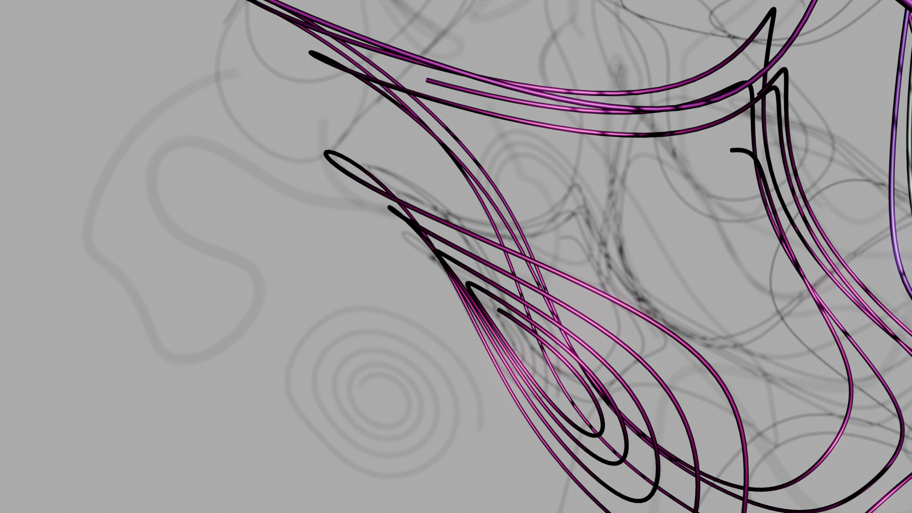
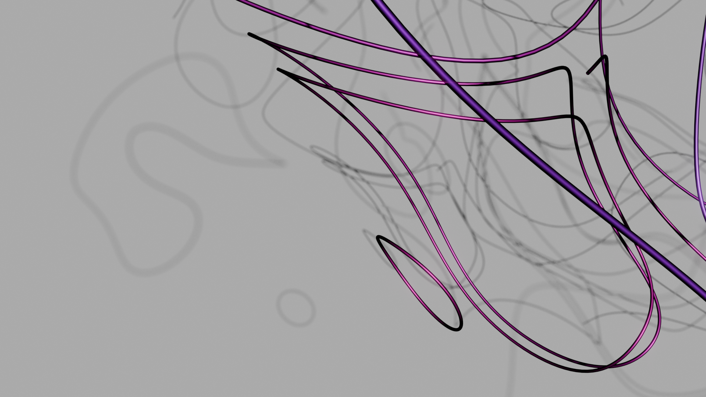

# DivFree-VectorNoise
This repository contains shaders and Python code that demonstrates methods from the paper "Improving Curl Noise" which is available here: https://doi.org/10.1145/3757377.3763980

<table>
<td> 
no reprojection
</td>
<td> 
with reprojection
</td>
</table>

In the paper we show that nD divergence-free vector noise can be generated by computing the cross product of n-1 gradients of scalar noise functions. This was known already in 3D, but in our paper we demonstrate that it generalizes to nD since the cross product does. The paper includes a proof that the resulting vector fields are in fact divergence free.

A distinct benefit of our method is that the streamlines of our divergence-free vector noise are simply the intersections of iso-contours of the original scalar noise functions. Thanks to this property it is possible to _reproject_ a point transported along the vector field back onto the precise streamline -- largely decoupling the precision with which the streamline is followed from the precision of the integration scheme. The two images above show the difference between streamline tracing without reprojection (left) and with reprojection (right).

## Shaders

The `.glsl` files in the `Shaders` directory are meant to be run in ShaderToy.

- `image_warping.glsl` produces warped 2D images of the type shown in Figure 5. This shader can also be accessed on ShaderToy: https://www.shadertoy.com/view/dl3cRf .
- `shader_2d_1d.glsl` This demonstrates curl noise within an area progressively constrained to follow the boundary curve.
- `shader_3d_2d.glsl` This demonstrates curl noise within a volume, progressively constrained to follow the enclosing surface.
- `shader_marble.glsl` produces warped 2D images of the type shown in Figure 5. This version is from the original supplementary material and does not have the AA option. 
- `shader_torus.glsl`  This demonstrates curl noise along a torus surface (like in Figure 6), obtained as the cross product of a solid noise gradient and the gradient of the torus distance field.

## Python and Blender files

In the `PySrc` directory you will find a collection of Python files and a blender file (for Blender 5.0.0). This example was not part of the original supplementary material but illustrates the method in 3D together with the full reprojection scheme. It is very similar to the fast forward video but was changed slightly in order to remove some code dependencies. The code that contains our contributions is in `dfvn.py` and `sine_wave_noise_3d.py` contains the noise function that we used in this demo. The file `streamlines.py` generates example streamlines and is only meant to be run from within Blender. 

If you open the Blender file (`streamlines.blend`) you should see two collections of stream lines (streamline_reproject_False and streamline_reproject_True) in the object hierarchy. The object names indicate whether our **reprojection** scheme was applied. When reproject is false the streamlines do not close up and when it is true many of the streamlines do close up. The streamlines are always closed, but since we only trace a finite length, the segment that is traced may not come full circle.

You can compute the streamlines yourself by loading and running the script `streamlines.py` from within Blender. The script requires `scipy` and should install it on its own. In line 19 you need to set the path to the `PySrc` directory before running otherwise key python files are not available. In line 32 you indicate whether to do reprojection. Other parameters are also available for tuning. Feel free to experiment.

# Authors

_Andreas Bærentzen, Jonas Martinez, Jeppe R. Frisvad, Sylvain Lefebvre_
